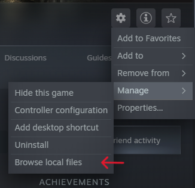

# Getting Started
 

## Installing BepInEx 5 LTS
**BepInEx** is required for modding **Obenseuer**.

Make sure to install **BepInEx 5 LTS**, as this is the supported version.

You can download it from the official BepInEx GitHub releases page:

- **Latest BepInEx 5 LTS:**  
  https://github.com/BepInEx/BepInEx/releases/tag/v5.4.23.2

Follow the installation instructions provided in the BepInEx repository to complete the setup before continuing.

> [!TIP]
> The game root folder is where the game executable is located.
>
> You can use the steams library **manage -> browse local files** feature to find it!
>
> 

 

## Installing Lavender

**Follow these steps to install Lavender:**

1. Download the **latest Lavender release** from here:  
   https://github.com/leonarudo/Lavender/releases/latest
2. Navigate to your Obenseuer installation folder and open:  
   `Obenseuer/BepInEx/plugins`
3. Create a new folder named `Lavender`
4. Copy the following files into the `Lavender` folder:
   - `Lavender.dll`
   - `Newtonsoft.Json.dll`
5. Done! Lavender is now installed and ready to use :D
